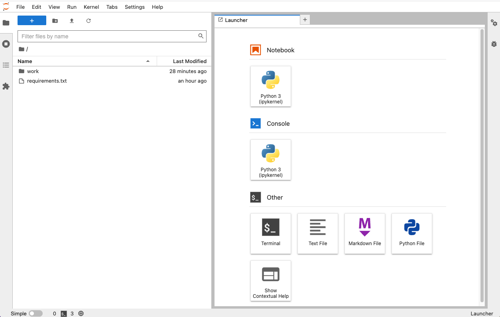

# SimuLatte
This projects aims to build confidence in your decision automation through simulations.

## Motivations
   * Trust your decision automation on large datasets coming from your production warehouse or synthetic.
   * How to execute a large dataset (millions to billions) of automated decisions based on business rules and machine learning.
   * How to apply analytics on these large decision sets to get business insights by computing KPIs and visualizing the results.
   * How can we navigate with ease in a decision set to search for specific decisions?
   * How to compose analytical dashboards for tour decision automation?
   * How to empower champion/challenger comparisions for automated decision services?
   
Simulatte combines:
   * a Spark based execution invoker to read a JSON request dataset and automate at scale the business decisions, and write them with their traces,
   * an analytics post-processing for computing metrics, KPIs and visualizations through Python and Jupyter notebooks.
   * a decision automation delegated to IBM Automation Decision Services(ADS) or IBM Operational Decision Services(ODM), 2 capabilities of the Cloud Pak for Business Automation. These 2 capabilities run an inference rule engine and ADS allows to call any ML model to bring probabilities in the decision making.

You can use Simulatte in an online mode through REST calls on microservices. Additionaly you can submit the decision invoker in a Spark batch to run in an Hadoop Spark cluster for maximum performances.

## Flavors
The simulation frameworks delivers a matrix of modes on the following dimensions:
   * online vs offline execution
   * remote REST vs embedded Java calls for the decision invocation,
   * basic Java single process single threaded, or Spark local, Spark cluster for full power,

## How to use the project

### Setup for docker use
Clone the repository:
By using http protocol
```bash
git clone https://github.com/DecisionsDev/simulatte.git
```
or ssh protocol
```bash
git clone git@github.com:DecisionsDev/simulatte.git
```

Move to the project directory.
```bash
cd simulatte
```
### Pre requisites
Docker installed
Be aware that Simulatte will use the following ports :
- port **3000** for grafana
- port **8080** for simulatte online
- port **8888** for jupiter notebooks
- port **4040** for spark jobs monitoring
- port **9060** only for ODM image use
- port **9443** only for ODM image use
- port **5432** for database
- port **9090** for prometheus

### Configure Decision Service invocation
Connect your SimuLatte instance with ADS or ODM:
   * [Configure with ADS](docs/CONNECT_ADS.md "Configure with ADS")
   * [Configure with ODM](docs/CONNECT_ODM.md "Configure with ODM")
   
### Run
Run docker compose commands 
```bash
docker compose build 
docker compose up -d
```

At the end you should see all containers (ODM exluded in this case) running as follows:
```bash
[+] Running 7/7
 ⠿ Network simulatte_default     Created                                                                                                                 
 ⠿ Container notebooks           Started                                                                                                                 
 ⠿ Container simulatte-db        Healthy                                                                                                                 
 ⠿ Container prometheus          Started                                                                                                                 
 ⠿ Container grafana             Started                                                                                                                 
 ⠿ Container simulation-service  Started                                                                                                                 
 ⠿ Container analytic-service    Started
 ```
 
To use simulatte notebooks, run the command below:
```bash
docker logs notebooks
```
Click on the `http://127.0.0.1:8888` link printed in your console.
You see the Jupyter web page.



On the left side navigate into the `work/notebooks` hierarchy.
You see ADS and ODM folders. <br>
Select the decisioning capability ADS by default. <br>
Select notebook for loyalty. <br>
Run all cells. <br>
Congratulations you have created a decision simulation, run it, to get insights about how your logic applies to the sampel dataset!

### Stop
To stop all simulatte containers : 
```bash
docker compose stop
```

### Troubleshooting
* Build
   * No space left on device
    You can encounter a space limit when building the images with the message like:
    ```bash
    ERROR: Could not install packages due to an OSError: [Errno 28] No space left on device: '/tmp/pip-uninstall-t79kgz4i'
    ```
    Resolution: Clean up the temporary folders and unnecessary resources in your Docker installation by running:
    ```bash
    docker system prune    
    ```

## Structure
The simulatte project is composed of the following building blocks:
   * [core](docs/core.md): a core library. It contains all common material to run simulations in online and offline. It covers the default decision service invokers for ADS and ODM.
   * [online](docs/online.md): online. This part comes as Docker microservices to execute decisions through a Java based container, and perform analytic post processing to produce a simulation report.
   * [offline](docs/offline.md): offline. This part gives a generic batch simulation runner capable to run standalone but on Hadoop Spark cluster too for maximum of scalability and performance with data residing in the lake. 


## Benchmarks
[benchmarks](docs/benchmarks.md): performances
