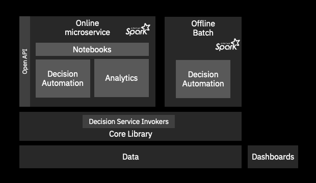

# SimuLatte
This projects aims to build confidence in your decision automation through simulations.

Simulatte combines:
   * a Spark based execution invoker to read a JSON request dataset and automate at scale the business decisions, and write them with their traces,
   * an analytics post-processing for computing metrics, KPIs and visualizations through Python and Jupyter notebooks.
   * a decision automation delegated to IBM Automation Decision Services(ADS) or IBM Operational Decision Services(ODM), 2 capabilities of the Cloud Pak for Business Automation. These 2 capabilities run an inference rule engine and ADS allows to call any ML model to bring probabilities in the decision making.

You can use Simulatte in an online mode through REST calls on microservices. Additionaly you can submit the decision invoker in a Spark batch to run in an Hadoop Spark cluster for maximum performances.

## Motivations
   * Trust your decision automation on large datasets coming from your production warehouse or synthetic.
   * How to execute a large dataset (millions to billions) of automated decisions based on business rules and machine learning.
   * How to apply analytics on these large decision sets to get business insights by computing KPIs and visualizing the results.
   * How can we navigate with ease in a decision set to search for specific decisions?
   * How to compose analytical dashboards for tour decision automation?
   * How to empower champion/challenger comparisions for automated decision services?

## Gallery
Examples of simulation outcomes produced with SimuLatte:
   * Loan approval donuts - screenshot
   * Scatters for loan applications - screenshot
   * Sandkey for rule coverage  - screenshot
   * etc

## Flavors
The simulation frameworks delivers a matrix of modes on the following dimensions:
   * online vs offline execution
   * remote REST vs embedded Java calls for the decision invocation,
   * basic Java single process single threaded, or Spark local, Spark cluster for full power,
   
## Structure
The simulatte project is composed of the following building blocks:
   * [core](docs/core.md): a core library. It contains all common material to run simulations in online and offline. It covers the default decision service invokers for ADS and ODM.
   * [online](docs/online.md): online. This part comes as Docker microservices to execute decisions through a Java based container, and perform analytic post processing to produce a simulation report.
   * [offline](docs/offline.md): offline. This part gives a generic batch simulation runner capable to run standalone but on Hadoop Spark cluster too for maximum of scalability and performance with data residing in the lake. 



## How to use the project

### Setup
Clone the repo.
Move to the project directory.

```bash
cd simulatte
export BASE_DIR=$PWD
```
### Configure Decision Service invocation
   * [Configure with ADS](docs/CONNECT_ADS.md "Configure with ADS")
   * [Configure with ODM](docs/CONNECT_ODM.md "Configure with ODM")

### Build
Build the librairies and Docker images for the microservices.
```bash
mvn clean install
```
### Run
Start the set of microservices with Docker compose.
```bash
Docker-compose up
Main service is accessible at the url ...
```

## Benchmarks
[benchmarks](docs/benchmarks.md): performances
